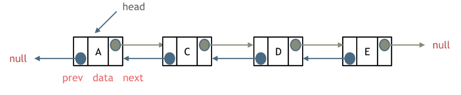
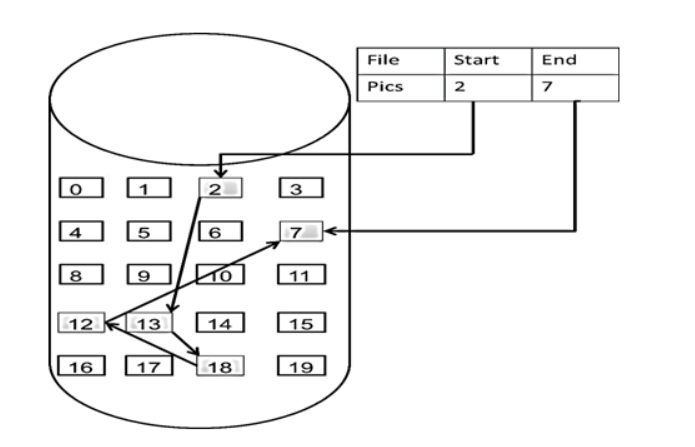
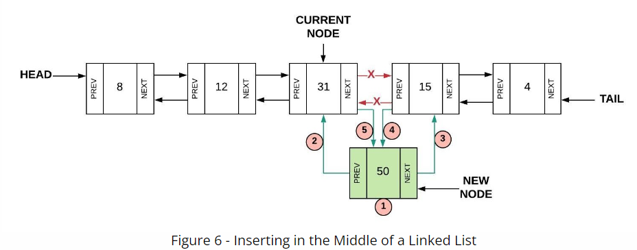

# Linked List Tutorial

## Introduction

A linked list is a linear structure connected by pointers. Each node consists of two parts, one is the data field and the other is the pointer field (which stores the pointer to the next node), and the pointer field of the last node points to null (null pointer).

We only discuss doubly-linked list here since it is usually much more useful than singly-linked lish.



In the linked list, the first node is called the *head* and the last node is called the *tail*. Each element in the linked list is called a *node*. And each node has two pointers, which are *previous* and *next*. Previous points to the last node and next points to the next node.

## How Linked List Stores Elements in Memory

Arrays are distributed continuously in memory, but linked lists are not distributed continuously in memory.

A linked list is linked to each node in the memory through the pointer of the pointer field.

Therefore, the nodes in the linked list are not continuously distributed in the memory, but scattered at an address in the memory. The allocation mechanism depends on the memory management of the operating system.



## Linked list in Python

Linked list is more complicated than stack. Let's learn how to insert element, remove element, and loop through the linked list.
### Insert and Delete
Linked lish in python is more complicated than stack. Insert and delete an element takes a few steps but they are efficient that both of their efficiency are O(1). But if you want to insert or remove an element in the middle, you have to find where that element is. This process takes O(n) to compete.
For example, if you want to remove the fifth element, you have to find where the next pointer of the forth element and the previous pointer of the sixth element are.
#### Insert
##### Insert Head
Here is a sample how you insert head.
```python
def insert_head(self, data):
        # Create a new node
        new_node = Linked_list.Node(data)
        # Check the linked list has data in it or not 
        if not self.head:
            # If not, just set new node to the head and tail
            self.head = new_node
            self.tail = new_node
        # If it has data, do three step
        # set new node's next to the head
        # set head's prev to the new node
        # set head to new node
        else:
            new_node.next = self.head
            self.head.prev = new_node
            self.head = new_node
```
It takes four steps. First we create a new node. Then, we set new node's next to the head. Next, we set head's prev to the new node. Last, we set head to the new node.
##### Insert from Middle and Insert Tail
Here, a picture demostrats how you insert a element in the middle of the linked list.



It takes 5 steps:
1. create a new node
2. set new node's prev to the current node
3. set new node's next to the current node's next node
4. set current node's next to the new node
5. set the current node' next node to the new node

Insert tail is very similar to insert head.
Try yourself to implement insert from and insert tail methods!

Template: [insert](linked_list_insert.py)
#### Remove
Remove is not as complicated as insert. It only takes two steps to remove a ndoe from a linked list.
##### Remove Head
Remove head takes two steps
1. set head's next node's prev to None
2. set head to head's next node
```python
def remove_head(self):
    if self.head:
        self.head.next.prev = None
        self.head = self.head.next
        self.size -= 1
    else:
        print("Empty linked list.")
```

##### Remove Tail and Remove a Node in the Middle
Now, using the same strategy, try yourself to write remove tail and remove a ndoe in the middle methods.(Hints are in the template)

Template: [remove](linked_list_remove.py)

#### Size
The size is maintained within the linked list class. Every time you insert a node, you plus one to the size and every time you remove a node, you minus one to the size.

 #### Sample Linked List in Python
 Here we have a sample of linked list. It will have all the methods mentioned above as well as iter and str operators. Please try not to look at it before you finished the practices.
 
 Sample: [sample](linked_list_sample.py)

 ### Problem
 #### Reverse
 Implement the reverse method to allow a linked list to iterate backward through the linked list.

 #### Insert Advance
 Now you have a linked list that contains multiple same elements. Implement the insert from method to allow user to choose which one to insert, the first or the second. If the user choose the second but the linked list only contains one, give user an error message.

Template: [problem](problem.py)
Solution: [problem solution](problem_solution.py)