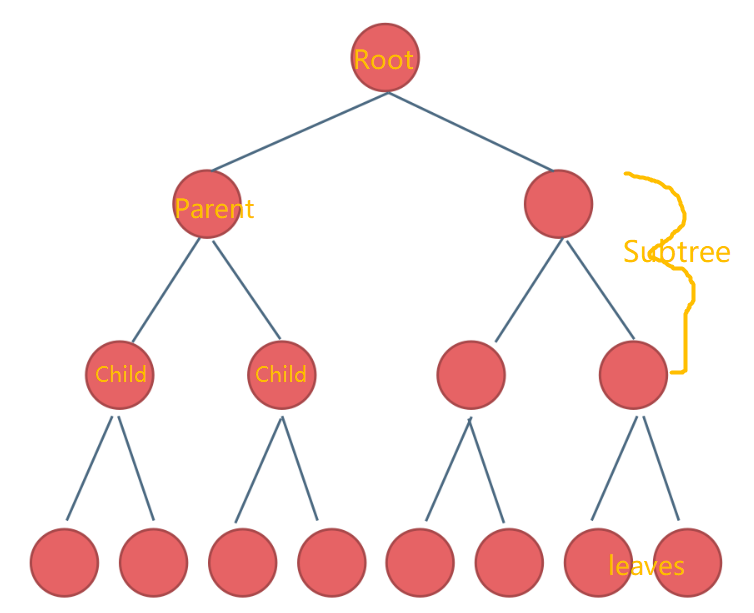
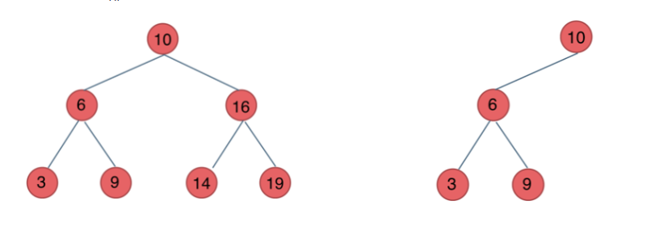

# Tree

## Introduction

### Tree
A tree, as its name implies, is a tree-like structure. Much like a linked list, it is also linked by pointers to data together. The difference is that one node of the tree can be connected to many different nodes. Here we will mainly learn about binary trees.

### Binary Tree
A binary tree is a tree in which each node can link at most two other nodes. We call the top node root. The nodes to the left and right of any parent node form a subtree. The nodes with no children are called leaves. A node that has connected nodes is called a parent node. The node connected to the parent are called child nodes.


### Binary Search Tree
Binary search trees(BST) are numeric and ordered trees. It follows these rules:
1. If its left subtree is not empty, then the value of all nodes in the left subtree is less than the value of its root node.
2. If its right subtree is not empty, then the value of all nodes in the right subtree is greater than the value of its root node.

Using binary search trees, we can quickly sort a bunch of data (as you may have noticed, the process is similar to the binary sorting). Anything bigger than the node is placed on the right, and smaller than it is placed on the left. When we want to read these data, we can quickly find the data we want.


As shown on the left above, when we want to find out whether 3 is in the structure, we first compare 10 and 3. 3 is smaller than 10, so we go to the left of 10 which is 6. Comparing 6 and 3, 3 is smaller than 6, then we go to the left side of 6, which is 3. We found 3. It only take 3 steps to find 3 in 7 elements.

### Balanced Binary Search Tree
A balanced search binary tree is a search binary tree in which the height difference between any two subtrees does not differ significantly. This is also our most widely used tree. Imagine if the root of a tree is the smallest value, and the rest of the values are sorted by size, then the tree will become no different from the linked list. This also loses the significance of the tree.

In the right picture above, it is not a balanced search binary tree.

### BST in Python

Most of the operations of BST need to use recursion, they are more complicated and it takes some time to understand them, but once you understand them, you will find them really convenient.

We will discuss these operations and try to write them by yourself:
1. Insert - Insert a value into the tree.
3. Contain - Determine if a value is in the tree.
5. Traverse forward - Visit all objects from smallest to largest.
6. Traverse backward - Visit all objects from largest to smallest.

We first create a BST class and next we together figure out how to implement those methods.
```python
class BST():
    
    class node():

        def __init__(self, data):
            self.data = data
            self.left = None
            self.right = None

    def __init__(self):
        self.root = None
```
#### Insert
The idea is that we use recursion. 

1. Determining recursive function parameters and return values. The parameters we need are the inserted value itself, and a node (from root).
2. Determine the termination conditions. We will stop the recursion when the node has no children. And insert the value into either the node's left or right.
3. Determining the logic of a single level of recursion. When we have a node and a value that we want to insert, we compare the node's value to the size of the value. If the node's value is greater than it, then it goes to the left of the node. Otherwise, go to the right.
```python
def insert(self, data):
        if self.root:
            self._insert(data, self.root)
        else:
            self.root = BST.node(data)

    def _insert(self, data, node):
        if data < node.data:
            if node.left:
                self._insert(data, node.left)
            else:
                node.left = BST.node(data)
        else:
            if node.right:
                self._insert(data, node.right)
            else:
                node.right = BST.node(data)
```
#### Contain
We use the same method to find if the tree contains a value. Just change the termination condition. Returns True when the value of the current node is equal to the searched value. If there are no nodes down, then return False
```python
def __contains__(self, data):
        return self._contains(data, self.root)

    def _contains(self, data, node):
        if not node:
            return False
        elif data == node.data:
            return True
        else:
            if data < node.data:
                return self._contains(data, node.left)
            else:
                return self._contains(data, node.right)

```

#### Traverse forward

#### Traverse backward


### Example
Template: [postorder and preorder](tree_example.py)
Solution: [postorder and preorder](BST_post_pre_order.py)

### Problem